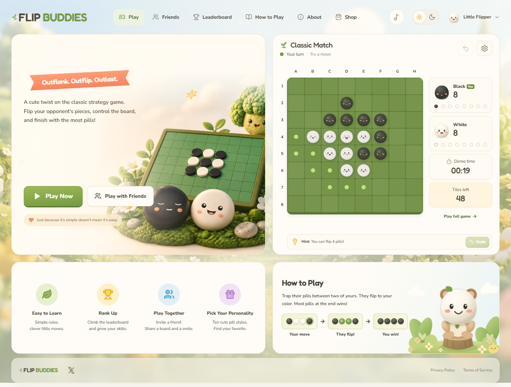

# Flip Buddies

A friendly Othello game with animated pill characters. Play against the CPU,
invite a friend, and make each move your own with ten character styles.

[Play the demo](https://flip-buddies.deifos.partykit.dev/) ·
[Run locally](#run-locally) · [Deploy your own game](docs/deployment.md) ·
[Contribute](CONTRIBUTING.md)



Built with **React 19, TypeScript, Vite, Three.js, and PartyKit**.
The source code and original game artwork and music use the [MIT license](LICENSE).

## Features

- **CPU play:** Three difficulty levels, legal-move hints, undo, surrender,
  rematch, and a saved match. CPU search runs in a browser worker.
- **Friend matches:** Private room codes and invite links, ready checks,
  reconnect support, and rematches that swap colors. The server checks each move.
- **Complete rules:** Eight capture directions, automatic passes, and correct
  game endings, including a game that ends before the board is full.
- **Ten pill styles:** Animated faces, capture flips, small jumps, and result
  celebrations. Each friend keeps their chosen style.
- **Practice rankings:** All-time, seven-day, and thirty-day results. The server
  checks submitted move records. Failed uploads retry when the service returns.
- **Sound and music:** Two sound styles, five original songs, separate mute and
  volume controls, and no playback before user input.
- **Access and display:** Keyboard board controls, phone layouts, light and dark
  themes, reduced motion, and an HTML board when WebGL is unavailable.

## Run locally

Install **Node.js 24.x** and Git. npm is included with Node.js.
No hosted account or API key is needed for local play.

```sh
git clone https://github.com/deifos/Othello.git
cd Othello
npm ci
npm run dev
```

Open [localhost:5173](http://localhost:5173). The command starts three services:

| Service | Address | Purpose |
| --- | --- | --- |
| Vite | `http://localhost:5173` | Website and browser code |
| Node.js | `http://localhost:3001` | Local practice rankings, stored in SQLite |
| PartyKit | `http://localhost:1999` | Local friend rooms |

Local defaults work without an environment file. To change them, copy
[.env.example](.env.example) to `.env.local`. Stop all three services with Ctrl+C.
For CPU play only, use `npm run dev:web`. Rankings and friend rooms need their
respective services.

## How to play

1. Choose **Play Now** for CPU play, or **Play with Friends** to create a room.
2. In a friend room, share the invite link or room code. Both players choose
   **I'm ready**. Use separate browser profiles to test two players on one device.
3. Select a glowing tile, then choose **Place pill**. A move must trap one or more
   opponent pieces between the new piece and another piece of your color.
4. Black moves first. If a player has no legal move, their turn passes. When
   neither player can move, the player with the most pieces wins.

Use the arrow keys to move across the board. Enter or Space selects a tile.
CPU undo returns to the position before your last move and the CPU reply.
Undo is not available in friend matches.

## Commands

| Command | Purpose |
| --- | --- |
| `npm run dev` | Start the website, local rankings, and friend rooms |
| `npm run dev:web` | Start only the website |
| `npm run dev:multiplayer` | Start only local PartyKit rooms |
| `npm test` | Run rule, service, storage, audio, and network tests |
| `npm run build` | Check TypeScript and build the website into `dist/` |
| `npm run preview` | Inspect the built website locally; separate services are still needed |
| `npm start` | Serve `dist/` and the SQLite ranking API on port 3001 |
| `npm run deploy:multiplayer` | Deploy PartyKit services and the current `dist/` website |

Run `npm run build` before `npm start`, `npm run preview`, or a deployment.
The [CI workflow](.github/workflows/ci.yml) runs tests and the build for pushes
and pull requests. See the [verification record](docs/verification.md) for browser
checks and their limits.

## Deploy your own game

There are two supported arrangements:

| Hosting | Website | Friend rooms | Practice rankings |
| --- | --- | --- | --- |
| PartyKit | PartyKit static assets | PartyKit | PartyKit storage |
| Vercel + PartyKit | Vercel, using the Vite preset | PartyKit | PartyKit storage |

Follow the [deployment guide](docs/deployment.md) for the build settings,
environment variables, and allowed website address. A static Vercel deployment
alone does not start the services in `server/` or `party/`.

For a Node.js host, `npm start` serves the website and rankings. Keep its SQLite
database on persistent storage and host friend rooms on PartyKit. See
[server setup](server/README.md).

Deploy your own PartyKit project for a fork. The public demo address is for
playing the demo; it is not the default service for other deployments. Production
settings belong in your hosting dashboard or an ignored `.env.production.local`.
Values that start with `VITE_` are visible to visitors. Never put secrets in them.

## Data and limits

- Profiles, preferences, CPU saves, result queues, and private room seat keys
  are stored in the browser. Clearing site data removes those local copies.
- The configured practice service stores submitted names, styles, moves, and
  results. Clearing browser data does not remove results already sent to it.
- Friend rooms use saved server state. A disconnected player has 60 seconds to
  return. See [room behavior](docs/multiplayer.md) for expiry and rematch rules.
- Friend matches are unranked. Practice rankings check legal moves, but cannot
  prove who selected them. There is no account sign-in, random matchmaking,
  friend list, or competitive rating system.
- The current PartyKit practice store is for a small public game: at most 5,000
  profiles and 50,000 result receipts. Larger use needs stronger abuse controls
  and a more efficient ranking index.
- Local SQLite data and hosted PartyKit data are separate. Deployment does not
  copy local records to the public service.

## Project guide

| Path | Purpose |
| --- | --- |
| `src/App.tsx` | Pages, navigation, profiles, and settings |
| `src/game/` | Othello rules, CPU worker, and multiplayer protocol |
| `src/lib/` | Match lifecycle, storage, network clients, audio, and music |
| `src/components/` | Game board, pill characters, and page components |
| `src/animation/` | Capture motion, expressions, and celebrations |
| `src/styles/characters.ts` | Character style registry |
| `party/` | Hosted friend rooms and practice ranking API |
| `server/` | Node.js website server and SQLite practice API |
| `public/` | Assets and license notices shipped with the website |
| `tests/` | Automated checks |
| `docs/` | Deployment, architecture, artwork sources, and verification |

To add a character palette or a supported accessory, add a record to
`src/styles/characters.ts`. A new accessory shape also needs Three.js geometry in
`GameBoard.tsx` and an avatar drawing in `PillAvatar.tsx`.

## Contributing

Bug reports, documentation fixes, and focused pull requests are welcome.
Read [CONTRIBUTING.md](CONTRIBUTING.md) before you start. For a security issue,
follow [SECURITY.md](SECURITY.md).

## License and credits

The code, original game artwork, documentation, and five supplied songs are
released under [MIT](LICENSE). The game was built by
[Vlad](https://x.com/deifosv) for his wife, who loves Othello.

Third-party libraries and fonts retain their own licenses. See
[THIRD_PARTY_NOTICES.md](THIRD_PARTY_NOTICES.md) and the notices in
[`public/licenses/`](public/licenses/). UI SFX provides the sound effects.
Fredoka and Nunito provide the typefaces.

The garden images were generated with an image tool. Source images, revisions,
and prompts are in the [artwork record](docs/asset-prompts.md). The
[music record](public/audio/music/README.md) lists the original songs.
